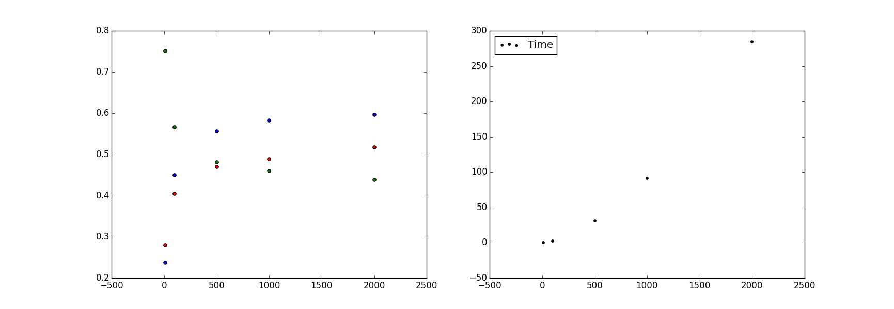

# Alignment with IBM Model I, Enhanced
Adam Poliak — apoliak1 <br>
Jordan Matelsky — jmatels1

-----

> We intended to implement an alignment algorithm to optimize for reducing AER, basing our work primarily on the IBM Model I<sup id="a1">[1](#f1)</sup>. In the following sections, we explain **(1)** our implementation and **(2)** the specific modifications we made to IBM Model I, and the mathematical motivation behind the modifications.

## Implementation
Our implementation is based on IBM Model I, defining the likelihood of alignment of native word $e$ against foreign word $f$ as:

$$\displaystyle P(e|f) =\prod_{i} \sum_{j} P\left( a_i = j  \big{|} |e| \right) $$

We experimented with varying numbers of iterations over which to train our model, finally settling on $10$ iterations as a reasonable compromise between accuracy and time-complexity.

## Modifications
In order to improve the accuracy of our alignments, we chose to treat the corpus both as a $e→f$ lookup as well as a $f→e$ lookup. In this way, we were able to train in *two* directions, and then compare the results.

Our initial results took the form of $\left(\left(e_i, f_j\right), P\left(e_i→f_j\right)\right)$, where $e_i$ is a native word, $f_j$ is a foreign word, and $P\left(e_i→f_j\right)$ is the probability that $e_i$ aligns to $f_j$.  With our back-and-forth modification, our results took the form of 2-tuples, where $e_i \in \mathbb{E}, f_j \in \mathbb{F}$:

$$\left[\left(\left(e_i, f_j\right), P\left(e_i→f_j\right)\right), \left(\left(f_j, e_i\right), P\left(f_j→e_i\right)\right)\right]$$

That is, for each $e_i$ and $f_j$, we had either a positive probability of alignment, or no such tuple ($P=0$).

From this point, we chose to experiment with ways of combining the relative probabilities in order to maximize alignment accuracy. Our functions took the form $\varphi : (P(f|e), P(e|f)) → \sigma$, where $\sigma$ was some scalar such that $max(\varphi)$ represents the correlation between $e$ and $f$ that maximizes alignment accuracy (as determined by `score-alignments`).

The function upon which we finally arrived was $\varphi_{diag}$:

$$\displaystyle \varphi_{diag} = \frac{(P(f|e) + P(e|f))}{|i + j| + 1}$$

...where $i \in e_{sent}$ and $j \in f_{sent}$. Simply, we took the sum of the probabilities of $f→e$ and $e→f$, and divided by the absolute value of their index differences in a sentence. (The $+1$ is intended to prevent divide-by-zero cases.)

This function favors 'diagonal' sentences — sentences in which the alignment of a word at index $i$ in $e_{sent}$ is $j$ in $f_{sent}$, minimizing the distance between $i$ and $j$. Consider the sentences:

```
  Alignment 8  KEY: ( ) = guessed, * = sure, ? = possible
  ---------------------------------------------------------------
 |(?) ?                                                           | jusque
 | ? (?)                                                          | ici
 |       *             ( )                                        | ,
 |         (?)                                                    | près
 |          ?                ( )                                  | de
 |             * ( )                                              | $
 |                * ( )                                           | 250,000
 |                   *       ( )                                  | ont
 |                      *    ( )                                  | été
 |                        (?)                                     | octroyés
 |                           (*)                                  | par
 |                              (*)                         ?     | le
 |                                 (*)                            | institut
 |                                     *    ( )                   | en
 |                                       (*)                      | subventions
 |                                          (?)                   | à
 |                                    ( )       ?                 | la
 |                                              *    ( )          | recherche
 |                                                 *    ( )       | ou
 |                                          (?)                   | à
 |                                           ?        ?  ?  ? ( ) | de
 |                              ( )                   ?  ?  ?     | les
 |                                                    ?  ? (?)    | programmes
 |                                                    ?  ?  ? ( ) | de
 |                                                    ?  * (?)    | éducation
 |                                                    ?  ?  ? ( ) | de
 |      ( )                                           ?  ?  ?     | le
 |                                                    ?  ? (?)    | public
 |                                                            (*) | .
  ---------------------------------------------------------------
   s  f  ,  a  $  2  h  b  i  b  t  i  i  g  f  r  o  p  e  a  .
   o  a     r     5  a  e  s  y  h  n  n  r  o  e  r  u  d  c
      r     o     0  v  e  s     e  s     a  r  s     b  u  t
            u     ,  e  n  u        t     n     e     l  c  i
            n     0        e        i     t     a     i  a  v
            d     0        d        t     s     r     c  t  i
                  0                 u           c        i  t
                                    t           h        o  y
                                    e                    n
```
In this case, word alignments that are close to the same index (low $|j-i|$), such as `research` and `recherche`, are favored. With this system, a word with index $x$ aligning to a word with index $x$ has approximately twice as high a probability of being aligned to a word with index $x+1$.  This works relatively well for grammars that follow the same phrase order. However, we anticipate this algorithm being deletorious in cases where it is used to align two languages whose phrase-orders differ (`subject-verb-object` vs `object-verb-subject`, for instance) or in languages where word order is unimportant, or variable.


## Future Work
We foresee several ways in which our algorithm could be improved both in the French→English case, as we used for testing and experimentation, as well as in the general language-to-language case.

- **Parallelization**. We began to experiment with parallelization of independent segments of our algorithm in order to improve wall-clock time with no change to algorithmic time-complexity. These tests are available in the `align_merge_parallel` executable. However, we experienced memory-allocation errors at larger volumes of input data when we ran on conventional hardware (AWS EC2 m3.medium). Though we anticipate more performant runs on cluster-based architectures, we had inadequate time to test this entirely.
- **Improved, later-generation IBM Model.** Using a more sophisticated basis for alignments, *prior* to adding our "back-and-forth" system, would greatly reduce our alignment error rate. We anticipate making these changes in the future, and have written our system to be modular in order to simplify the process of adding these additions.
- **Loop combination.** We iterate through our vocabularies several times. We anticipate being able to reduce the amount of looping we perform in several ways, given adequate development time.

## Performance Data
We collected metrics over a variety of runs. The timing data are averaged over several runs, while the (deterministic) AER, precision, and recall remained consistent with the same parameters.



> x: Number of sentences. y: Value. On the left, green represents AER, red represents recall, and blue represents precision. The code used to generate this figure is available in `generate_table1.py`. On the right, black points mark the time taken to calculate that many sentences, using 5 iterations. The calculation is clearly superlinear. We predict approximately $O(n^3)$.

-----
<b id="f1">1</b> Our implementation is derived in general from the text available [here](http://www.statmt.org/book/slides/04-word-based-models.pdf).  [↩](#a1)
